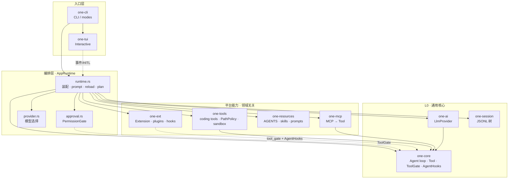
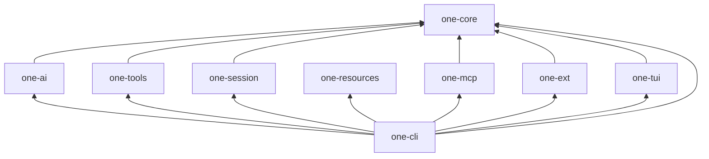
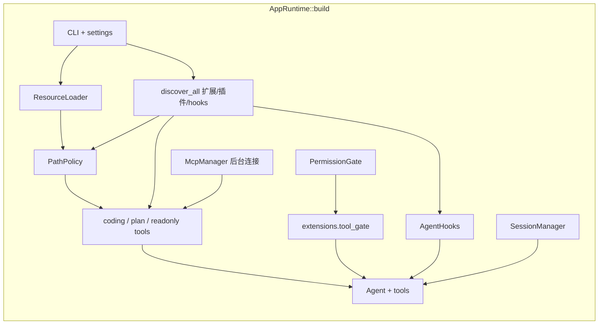
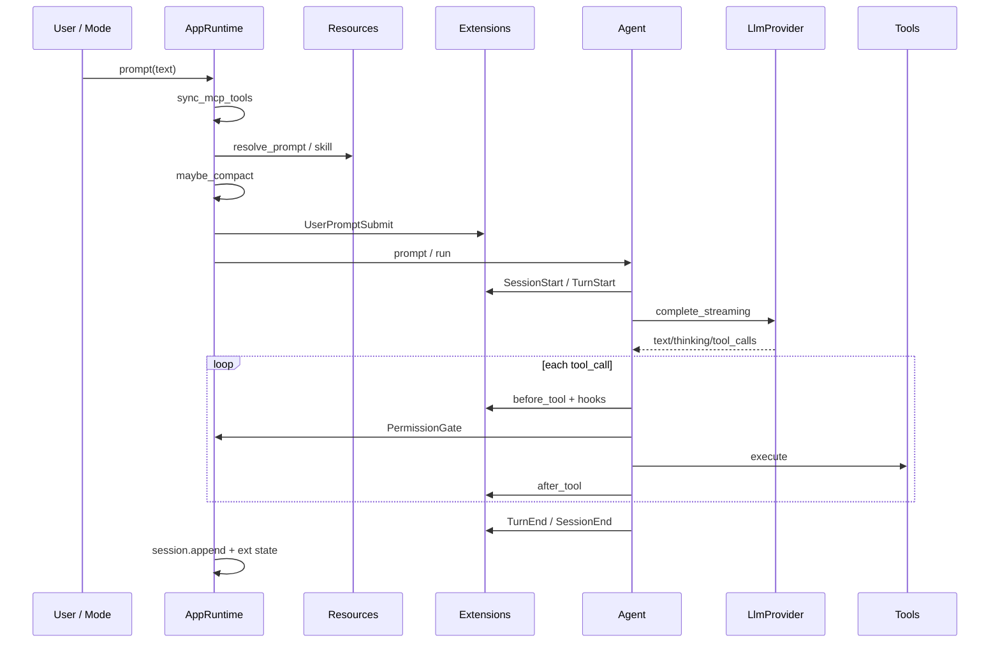
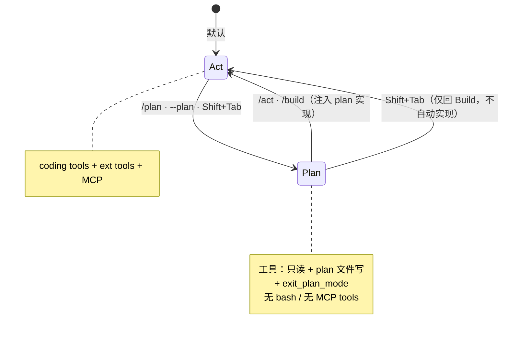
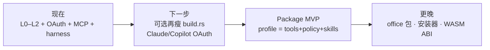

# One 架构图（活文档）

> **维护约定**：实现新能力或改分层时，**同步更新本文**（尤其是 §2 状态矩阵、§3 依赖图、§9 简洁性评估）。  
> 细节专题见文末文档索引；本文只回答三件事：  
> 1. **系统长什么样**  
> 2. **现在做了什么 / 还没做什么**  
> 3. **实现是否干净、边界是否清楚**

**最近修订**：2026-07-21（分层 Memory 设计入矩阵，暂不实现；见 [memory.md](./memory.md)）

---

## 1. 一图总览



**读图要点**

| 原则 | 含义 |
|------|------|
| Core 不认识业务领域 | `one-core` 只有 loop / message / Tool trait / 门控插槽 |
| 装配在 CLI | 工具列表、扩展、MCP、权限、Plan 模式都在 `AppRuntime` 拼装 |
| 统一 Tool 面 | 内置 / 扩展 / MCP 最终都是 `Arc<dyn Tool>` |
| 扩展不进 Core | `one-ext` 经 `ToolGate` + `AgentHooks` 桥入，Core **无** `one_ext` 依赖 |

---

## 2. 能力状态矩阵

图例：✅ 已落地 · 🟨 部分/实验 · 📝 仅设计 · ❌ 非目标

### 2.1 产品能力

| 能力 | 状态 | 主要位置 | 备注 |
|------|------|----------|------|
| Agent loop（prompt→LLM→tool→loop） | ✅ | `one-core/agent` | 短循环，max_turns |
| Streaming text / thinking | ✅ | `one-core` + `one-ai` + TUI | SSE 真流式 |
| Thinking level | ✅ | settings / session / providers | off/low/medium/high |
| 内置 coding tools | ✅ | `one-tools` | read/write/edit/bash/bash_output/bash_kill/grep/find/ls/ask_user + network |
| OAuth / 订阅登录 | ✅ | `one-ai/auth` + `one-cli/auth_cmd` | Codex · xAI · OpenCode Zen/Go；Claude/Copilot 待 |
| 工作区 PathPolicy | ✅ | `one-tools/path_policy` | 默认 workspace-write |
| OS sandbox (bwrap) | ✅ | `one-tools/os_sandbox` | bash 可选 |
| 沙箱提权（Codex 对齐） | ✅ | `sandbox_permissions` + `PermissionGate` | `require_escalated` / escalate_on_failure |
| 权限门控 allow/deny/ask | ✅ | `one-cli/approval` + `ToolGate` | 规则 + 交互 |
| Session JSONL 树 | ✅ | `one-session` | v3 子集 + 迁移 |
| Session UX（continue/resume/new/tree） | ✅ | runtime + TUI | export/share 有 |
| AGENTS.md / CLAUDE.md | ✅ | `one-resources` | 向上发现（静态 L1） |
| Skills progressive disclosure | ✅ | `one-resources/skills` | catalog + read |
| 分层 Memory（跨 session） | 📝 | [memory.md](./memory.md) | L0–L4 工作集选择；**暂不实现** |
| Prompt 模板 `/name` | ✅ | `one-resources/prompts` | |
| Compaction | ✅ | `one-core/compaction` + runtime | LLM 摘要 + overflow 重试 |
| 四模式 Interactive/Print/JSON/RPC | ✅ | `one-cli/modes` | |
| 执行轨迹 / harness 评测 | ✅ | `one-core/trace` + Langfuse `--trace` / `one bench` | 可选 TraceSink → Langfuse；见 [harness-eval.md](./harness-eval.md) |
| Plan / Act 模式 | ✅ | runtime + tools/plan | 硬工具门控 |
| MCP 平台客户端 | ✅ | `one-mcp` | stdio + streamable HTTP；**只加载 One 配置** |
| MCP 从其他 agent 导入 | ✅ | TUI `/mcp` · `one mcp import` | Claude/Codex/Cursor 显式导入 |
| MCP OAuth | ❌/待 | — | roadmap M4 |
| Extension 运行时 | ✅ | `one-ext` | Codex 对齐能力面 |
| External hooks.json | ✅ | `one-ext/hooks` | Pre/Post tool 脚本 |
| Plugins（plugin.json） | ✅ | `one-ext/plugin` | 本地发现，无商店 |
| dylib 动态扩展 | 🟨 | `one-ext` feature | 仅 builtin 名映射 |
| Package / Suite 领域包 | 📝 | [package-suites.md](./package-suites.md) | **未实现** |
| 程序化 result envelope / CI bare | 📝 | [claude-workflow-model.md](./claude-workflow-model.md) P0 | 设计已拍板 |
| Subagent（task / agents.md） | 📝 | [subagents.md](./subagents.md) P1 | 设计草案；未实现 |
| 宿主 spawn（CLI/RPC） | 📝 | 同上 P2 | 编排刚需；未实现 |
| Workflow（外置脚本 / YAML） | 📝 | 同上 P3 | **默认外置**；不内嵌 QuickJS |
| Agent Teams（peer 协作） | ❌ | — | 后置 / 非默认 |
| 内嵌 JS workflow runtime | ❌ | — | 非目标（§5.1） |
| TS 扩展兼容 | ❌ | — | 评估中 |

### 2.2 Crate 完成度（实现视角）

| Crate | 职责一句话 | 状态 | 洁净度* |
|-------|------------|------|---------|
| `one-core` | 通用 agent OS 内核 | ✅ 稳定 | **A** 边界清楚 |
| `one-ai` | Provider + auth + compat | ✅ 多厂商 + OAuth | **B** 适配器多但模式统一 |
| `one-tools` | 内置工具 + 沙箱策略 | ✅ | **B** 工具多，policy 集中 |
| `one-session` | 会话树持久化 | ✅ | **A** |
| `one-resources` | 弱代码资源 | ✅ | **A** |
| `one-mcp` | MCP→Tool | ✅ MVP+ | **A** 不污染 core |
| `one-ext` | 扩展/插件/hooks | ✅ 完整面 | **B** 面宽，入口单一 |
| `one-tui` | 终端 UI | ✅ | **B** UI 体积大属正常 |
| `one-cli` | 装配与入口 | ✅ | **B** runtime 已按职责拆分子模块（见 §7） |

\*洁净度：A 职责单一易读 · B 可维护有局部复杂度 · C 有集中编排债，应警惕继续膨胀

---

## 3. Crate 依赖图（真实依赖）



**依赖纪律（是否干净）**

| 规则 | 现状 |
|------|------|
| `one-core` 零业务 crate 依赖 | ✅ |
| `one-resources` 不依赖 core | ✅（纯资源） |
| MCP / Ext 只依赖 core，互不依赖 | ✅ |
| TUI 不依赖 tools/mcp/ext | ✅（经 CLI 传事件） |
| 只有 `one-cli` 做上帝装配 | ✅ 有意为之；文件过重见 §9 |

---

## 4. 逻辑分层（含规划层）

与 [package-suites.md](./package-suites.md) 对齐；**L3 未实现**。

```text
┌─────────────────────────────────────────────────────────────┐
│ L3  Package / Suite          📝 设计 only                    │
│     coding / office 发行版 · profile merge · --suite         │
└───────────────────────────────┬─────────────────────────────┘
                                │ 将来：声明式装配
┌───────────────────────────────▼─────────────────────────────┐
│ L2  Resources                ✅                              │
│     Skills · Prompts · AGENTS · plugin overlays              │
│     crate: one-resources (+ plugin 路径由 one-ext 发现)       │
└───────────────────────────────┬─────────────────────────────┘
                                │
┌───────────────────────────────▼─────────────────────────────┐
│ L1  Extensions + Hooks       ✅                              │
│     Extension trait · Registry · hooks.json · plugins        │
│     crate: one-ext                                           │
└───────────────────────────────┬─────────────────────────────┘
                                │ ToolGate / AgentHooks / tools[]
┌───────────────────────────────▼─────────────────────────────┐
│ L0  Core harness             ✅                              │
│     loop · session 格式 · Tool/Provider trait · compaction   │
│     + 平台：tools / mcp / path policy（由 CLI 注入，非 core） │
│     crates: one-core · (+ one-ai · one-tools · one-mcp …)    │
└─────────────────────────────────────────────────────────────┘
```

**原则（实现时自检）**

1. 能用 Skill/配置解决的 → 不做 Extension  
2. 能用 Extension 解决的 → 不改 Core  
3. 领域切换（编程/办公）→ 应走 Package，**禁止** `if suite == "office"` 进 Core  

---

## 5. 运行时装配：`AppRuntime` 是什么



| 字段（概念） | 来源 crate | 作用 |
|--------------|------------|------|
| `agent` | one-core | 消息与 loop |
| `extensions` | one-ext | 工具/门控/生命周期 |
| `resources` | one-resources | system prompt 材料 |
| `mcp` | one-mcp | 外部工具池（进程级） |
| `session` | one-session | 持久化 |
| `permission_gate` | one-cli | 人机审批 |
| `path_policy` / mode | one-tools + runtime | 沙箱与 Plan/Act |
| `hitl` | one-cli | ask_user / 审批通道 |

---

## 6. 关键数据流

### 6.1 一次用户 Prompt



### 6.2 工具执行管道（干净度关键路径）

```text
ToolCall
  │
  ├─① Extension::before_tool     (可 Rewrite / Deny)
  ├─② hooks.json PreToolUse      (可 Rewrite / Deny)
  ├─③ PermissionGate             (Allow / Ask / Deny)
  │     └─ ToolGateDecision::Rewrite → 写回 arguments
  ├─④ Tool::execute              (builtin | ext | mcp)
  └─⑤ after_tool + PostToolUse
```

Core 只看见 `ToolGate` + `Tool`；**不知道** Permission 规则长什么样、扩展叫什么名字 → 边界正确。

### 6.3 System Prompt 拼装

```text
DEFAULT_SYSTEM_PROMPT          # core role + tool policy（无 feature 包）
  + AGENTS.md / CLAUDE.md（向上合并）          # L1 静态
  + skills catalog XML（name/description/location only）
  + plugin system overlays
  + extension contribute_context()
  + [feature subagent on] TASK_TOOL_PROMPT_HINT
  + [Plan 模式] plan_mode_system_overlay
  # 设计中 · 暂未实现：memory catalog（L2 索引，session 冻结）
  # 见 docs/memory.md — body 不进 system，按需 read
```

**Settings features**（`settings.json` → `features`）：能力包开关（V1：`subagent`）。  
关闭后对应工具 + 提示词 section 一并去掉。改上下文的 feature 在已有对话中只 **pending**，`/new` 或冷启动后生效。  
组装入口：`runtime/prompt_compose.rs` + `runtime/features.rs`（`build` / `tools` / `plan` / `reload` 共用）。

### 6.4 配置与发现路径（磁盘）

```text
~/.one/agent/
  settings.json          用户设置
  mcp.json               MCP（用户）
  extensions.json        扩展清单
  hooks.json             外部 hooks
  plugins/<name>/        插件根
  skills/ · prompts/ · AGENTS.md
  builtin-skills/ · plans/ · sessions/

<cwd>/.one/
  mcp.json · skills/ · prompts/ · plugins/
```

兼容只读：`~/.agents/skills`、Claude/Codex/Cursor MCP 配置等（见 mcp.md / resources）。

---

## 7. 模块地图（按 crate）

便于「改功能先找文件」。

### `one-core` — 内核

| 模块 | 职责 |
|------|------|
| `agent` | loop、steering、follow-up、notification |
| `tool` / `tool_gate` | Tool trait、Allow/Rewrite/Deny |
| `hooks` | `AgentHooks` 插槽 |
| `message` / `events` / `streaming` | 协议面 |
| `compaction` | 阈值与摘要辅助 |
| `trace` | 可选 `TraceSink`（Langfuse 等） |
| `image` | 多模态块 |

### `one-cli` — 装配中心

| 模块 | 职责 |
|------|------|
| `runtime/mod.rs` | `AppRuntime` 字段 + 轻量控制（abort/steer/session 摘要） |
| `runtime/build.rs` | 冷启动装配（resources · ext · tools · mcp · session · features） |
| `runtime/plan.rs` | Plan/Act 切换与 mode 持久化 |
| `runtime/tools.rs` | 工具列表重建 + MCP generation 同步 |
| `runtime/features.rs` | settings feature 注册表 + pending/applied |
| `runtime/prompt_compose.rs` | system prompt 统一拼装（feature sections） |
| `runtime/prompt.rs` | `prompt` + compaction |
| `runtime/session.rs` | new/open/list session · thinking · apply features on `/new` |
| `runtime/reload.rs` | `/reload` 与 skills toggle · MCP 配置重读 |
| `runtime/subscribe.rs` | print/json/TUI 事件订阅 |
| `runtime/policy.rs` | PathPolicy 构造 |
| `approval` | PermissionGate + 交互审批 |
| `modes/*` | interactive / print / rpc |
| `provider` / `settings` | 模型与配置 |
| `auth_cmd` | `one login` / `one logout` |
| `mcp_cmd` | `one mcp` 子命令 |
| `bench_cmd` | `one bench` harness |
| `langfuse` | OTLP `TraceSink` |
| `hitl` | ask_user 通道 |

### `one-ext` — 扩展面

| 模块 | 职责 |
|------|------|
| `traits` | Extension facade |
| `registry` / `runtime` | 安装与调度 |
| `data` | ExtensionData 类型图 |
| `loader` / `plugin` | extensions.json + plugin.json |
| `hooks` | 外部命令 hooks |
| `builtin` | status 等内置 |

### 其它

| Crate | 关键模块 |
|-------|----------|
| `one-tools` | 各 tool 文件 + `tasks`（后台 bash 注册表）+ `path_policy` + `permissions` + `plan` + `os_sandbox` + `truncate` |
| `one-mcp` | `manager`（连接池）+ `config`（One-only + import）+ `tool` |
| `one-ai` | 各 provider + `auth/*`（OAuth）+ `registry` + `thinking` + `compat` + `models_file` |
| `one-session` | `manager` + `entries` + export/migrate/share + `prompt_history` |
| `one-resources` | `loader` + skills/prompts/agents + builtin-skills |
| `one-tui` | `app` / `state` / `settings` / `ui` / `slash` / float 选择器 / theme |

---

## 8. 运行模式与 Plan



| 模式 | 入口 | 持久化 | UI |
|------|------|--------|-----|
| Interactive | `one` | 默认 session | one-tui |
| Print | `-p` | 可选 | 流式 stdout/stderr |
| JSON | `--mode json` | 可选 | 事件行 |
| RPC | `--mode rpc` | 常 `--no-session` | stdin/out JSONL |

---

## 9. 简洁性 / 干净度评估

### 9.1 做得干净的地方 ✅

1. **Core 极瘦依赖**：无 MCP/Ext/Tools 反向依赖，可嵌入可测。  
2. **统一 Tool 接口**：三类工具源汇合方式一致，Agent 无特殊分支。  
3. **门控组合**：`ExtensionToolGate(inner: PermissionGate)` 管道清晰，可单测 deny/rewrite。  
4. **资源 progressive disclosure**：catalog 与正文分离，符合 agentskills。  
5. **MCP 平台化**：不塞进 Extension/Package，产品分层与 [mcp.md](./mcp.md) 一致。  
6. **Session 独立 crate**：格式与 loop 解耦。

### 9.2 已知不简洁 / 债务 ⚠️

| 问题 | 表现 | 建议方向 |
|------|------|----------|
| ~~**`AppRuntime` 单文件过重**~~ | ~~`runtime.rs` ~1200 行~~ | ✅ 已拆为 `runtime/{build,plan,tools,prompt,session,reload,…}` |
| **`build.rs` 仍偏长** | 冷启动步骤多（~280 行） | 可再抽 `discover_resources` / `spawn_mcp` 辅助函数；非紧急 |
| **coding tools 仍硬编码** | `coding_tools_*` 在 tools/runtime 写死 | 正是 Package/Suite 要迁出的东西 |
| **Extension 面偏宽** | 一个 trait 覆盖 Codex 多个 contributor | 可接受（Rust dyn 更简单）；勿再平行第二套 Plugin API |
| **dylib ABI 不完整** | 只能加载已知 builtin 名 | 文档已标明实验；完整 ABI 或 WASM 另开 |
| ~~**plugin MCP 只解析未合并**~~ | ~~manifest 有 `mcpServers` 未进 McpManager~~ | ✅ build/reload 已合并（同名时 One 配置优先） |
| **MCP 外源曾自动 merge** | 已改为默认 One-only + 显式 import | 逃生阀 `ONE_MCP_MERGE_FOREIGN=1` |
| **事件双通道** | `AgentEvent`（同步 UI）+ `AgentHooks`/`ExtensionEvent`（异步扩展） | 文档说清即可；勿再加第三套 |
| ~~SessionStart 每 turn~~ | ~~AgentHooks 把 run 映射成 SessionStart/End~~ | ✅ 现为 conversation 级：load/unload + `/new`/`/resume` |

### 9.3 健康度评分（主观，便于演进对照）

| 维度 | 分 (1–5) | 说明 |
|------|----------|------|
| 分层边界 | 4.5 | Core/平台/装配清楚；L3 未做 |
| 依赖方向 | 5 | 无环，单向 |
| 单文件复杂度 | 4 | runtime 已拆分；`one-tui/ui` 仍大（UI 常态） |
| 扩展点一致性 | 4 | Tool + Gate + Hooks 三插槽够用 |
| 领域无关 | 4 | 无 suite 分支；coding 默认仍代码内嵌 |
| 可测试性 | 4 | core/ext/e2e mock 有覆盖 |

**总评**：当前实现 **整体干净、可导航**。编排层已按职责拆文件；plugin MCP 已合并。下一刀「不简洁」主要是 **尚未外置的 coding profile（Package）**，而不是 Core 被污染。继续加功能时优先：能进 Skill/Package/Ext 的不要塞进 `runtime/build.rs`。

---

## 10. 演进路线（与架构的关系）



| 阶段 | 架构变化 | 状态 |
|------|----------|------|
| 现在 | L0+L1+L2 + CLI 装配 + OAuth/MCP/trace | ✅ |
| 拆分 runtime | 不改行为，降编排债 | ✅ |
| plugin MCP 合并 | build/reload 进 McpManager | ✅ |
| Package MVP | L3 落地，coding 变默认包 | 📝 |
| 多领域 | office 等包，Core 仍无分支 | 📝 |

---

## 11. 文档索引

| 文档 | 内容 |
|------|------|
| **本文** | 总图、状态、干净度 |
| [extensions.md](./extensions.md) | 扩展 / hooks / plugins 细节 |
| [mcp.md](./mcp.md) | MCP 配置与分层 |
| [package-suites.md](./package-suites.md) | L3 设计草案 |
| [session-format.md](./session-format.md) | JSONL 格式 |
| [cli.md](./cli.md) | 标志与 RPC |
| [roadmap.md](./roadmap.md) | 完成勾选与待办 |
| [development.md](./development.md) | 开发与测试 |
| [gap-vs-pi.md](./gap-vs-pi.md) | 与 Pi 差距 |
| [harness-eval.md](./harness-eval.md) | Langfuse 轨迹与 bench |
| [compat.md](./compat.md) | models.json compat |
| [claude-workflow-model.md](./claude-workflow-model.md) | Claude 分层对照 + 程序化路线 + 不嵌 QuickJS |
| [protocol.md](./protocol.md) | **Harness JSON**：Agent≡Subagent（prompt/tools/spawn） |
| [subagents.md](./subagents.md) | 子 agent 设计 |
| [memory.md](./memory.md) | 分层 Memory（工作集选择；暂不实现） |
| [plans/2026-07-19-programmatic-subagents.md](./plans/2026-07-19-programmatic-subagents.md) | W0–W2 实现计划 |

---

## 12. 修订记录

| 日期 | 说明 |
|------|------|
| 2026-07-21 | 分层 Memory 设计（[memory.md](./memory.md)）入矩阵与 §6.3 注释；暂不实现 |
| 2026-07-19 | 子 agent 从「非目标」改为分阶段 📝；程序化/workflow 文档索引；不嵌 QuickJS |
| 2026-07-19 | 状态矩阵补 OAuth / bash_output·kill；模块地图补 auth/bench/langfuse/trace；文档索引补 harness/compat |
| 2026-07-17 | `one-cli` runtime 拆为 build/plan/tools/prompt/session/reload 等；洁净度 C→B |
| 2026-07-17 | 升格为活文档：总图、状态矩阵、数据流、干净度评估 |
| 更早 | 初版分层与 crate 列表 |
