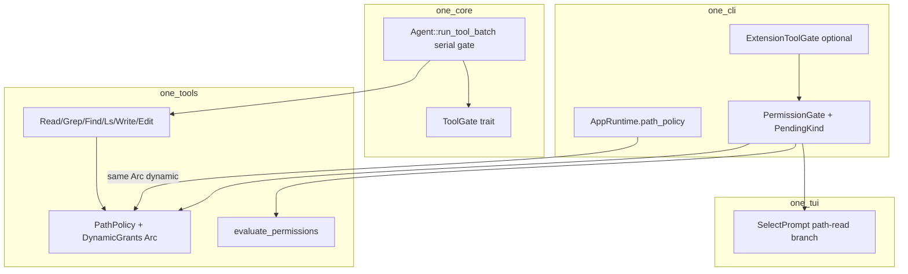

# Path-boundary read escalation via PermissionGate

| Field | Value |
|-------|--------|
| **Title** | Path-boundary read escalation via existing HITL / PermissionGate |
| **Author** | (TBD) |
| **Date** | 2026-07-26 |
| **Status** | Draft (rev 3 — subagent import Write-safety) |
| **Audience** | Senior engineers working in the `one` monorepo |
| **Related** | `docs/cli.md` (权限与路径沙箱 / 交互审批 / 沙箱提权), `docs/architecture.md` §5–6, `docs/subagents.md` |

---

## Overview

Today, file tools (`read`, `grep`, `find`, `ls`) hard-deny any path outside `PathPolicy` roots with a static error:

```text
path outside workspace (read denied): …
Allowed roots: …
Use --add-dir <path> to grant access, or --full-access to disable the boundary.
```

That is correct for fail-closed security (Codex-style workspace boundary), but poor interactive UX: when the user *wants* a peek at e.g. `~/.codex/config.toml` or a sibling project, the model retries several denied greps and the transcript fills with ✗ failures.

This design keeps the **default fail-closed** posture, and adds an **interactive-only** escalation path for **read** access outside the boundary. Escalation reuses the existing **PermissionGate → ApprovalRequest → TUI Select** channel (same as high-risk bash and `sandbox_permissions: require_escalated`), with three choices:

1. **Once (this path)** — allow this resolved path for the rest of the process (read only; if the path is a directory, that dir and its descendants)
2. **Session root** — add a suggested parent/root as a **session-scoped read-only** root (like a temporary read-only `--add-dir`), **only when the suggestion is not demoted**
3. **Deny** — keep hard deny; return a clear message to the model

Writes (`write` / `edit`) outside the workspace stay **hard-deny by default**. Path escalation is **not** wired through `ask_user`. `--yes` / `ApprovalMode::Auto` / bash **Always** → `session_auto` do **not** auto-grant path escapes and do **not** show path Select (path boundary stays hard-deny until process restart or explicit `--add-dir` at launch). `ONE_AUTO_APPROVE=1` while mode remains Interactive still shows path Select but never auto-grants.

**Shipping rule:** interactive path prompts must not land until `PendingKind`-aware `respond` **and** path-specific Select (no Always / no Ctrl+O) land together. There is **no** “generic Select interim.”

---

## Background & Motivation

### Current state (verified in tree)

| Layer | Location | Behavior today |
|-------|----------|----------------|
| Path boundary | `crates/one-tools/src/path_policy.rs` | `PathPolicy::{resolve,check}` with `AccessKind::{Read,Write}`, `SandboxMode::{WorkspaceWrite,FullAccess}`, `additional_roots`, `readable_roots`, `allowed_files` (exact match only) |
| Tool enforce | `read.rs`, `grep.rs`, `find.rs`, `ls.rs`, `edit.rs`, `write.rs` | Each tool owns a **cloned** `PathPolicy`; `execute` calls `policy.resolve(..., AccessKind::…)` |
| Materialize | `one-tools/src/registry.rs` factories | `ReadTool::with_policy(ctx.policy.clone())` etc. at build time |
| Runtime policy | `one-cli/src/runtime/policy.rs` `build_path_policy` | CLI `--add-dir` + `settings.additional_directories` + skill readable roots — **called only at `AppRuntime::build`** |
| AppRuntime | `one-cli/src/runtime/mod.rs` | Holds `path_policy: PathPolicy` assigned once in `runtime/build.rs`. Plan↔act **clones** that policy into tools (`plan_mode_tools_with_policy`, `rebuild_act_tools`); **does not** rebuild policy from settings mid-process |
| Settings `add_dir` | `settings.rs` + interactive `ConfigOp::SettingSet` | Persists JSON for the **next** process; does **not** mutate live `AppRuntime.path_policy` or rematerialize tools today |
| Permission rules | `one-tools/src/permissions.rs` | deny → ask → allow → defaults; **read tools default Allow**; PathPolicy is a *separate* layer |
| Gate | `one-cli/src/approval.rs` `PermissionGate` | `ToolGate` impl; `respond` maps **Always → `enable_session_auto()` unconditionally** today; bash escalate + high-risk Ask via oneshot + TUI |
| Core gate API | `one-core/src/tool_gate.rs` | `ToolGateDecision::{Allow,Rewrite,Deny}` — **Allow cannot mutate PathPolicy** |
| Agent batching | `one-core/src/agent.rs` `run_tool_batch` | **Gates are serial** (`gate_tool` per call); then `execute_slots` may run read-only tools in parallel |
| TUI | `one-tui/src/select.rs` | `SelectPrompt::permission_with_prefix`; special copy for `sandbox escalation:`; **generic path offers Always + Ctrl+O** |
| Bash OS escalate | `sandbox_permissions.rs` + `bash.rs` | Orthogonal to PathPolicy |
| Harness | `runtime/harness.rs` | `HarnessOptions { cwd, full_access, add_dirs, auto_approve, dynamic_tools }`; `build_policy` = workspace + add_dirs only; child approval is Auto or FailClosed — **never Interactive path Select** |

### Pain points

1. Interactive users who want out-of-tree reads must **restart** with `--add-dir` (or set `settings.additional_directories` and start a **new** process). Mid-turn `/settings add_dir` only updates on-disk settings today — it does not expand the live PathPolicy.
2. The model has no structured recovery: it sees a hard error string and often re-probes nearby paths → spam of denials.
3. Industry peers either hard-boundary everything (Codex path) or offer heavier path Ask UIs (Claude Code). One already has HITL Select for bash; path reads should ride the same rail **with path-safe choices only**.

### Non-problems (out of this feature)

- OS bubblewrap escape for bash remains the existing escalate flow.
- Expanding **writable** roots still uses `--add-dir` at launch / settings for next process / full-access.
- `ask_user` remains clarifying UX only (`PermissionGate` already short-circuits it to Allow).
- Live mid-session apply of `/settings add_dir` is a useful **orthogonal** follow-up, not required for path escalation.

---

## Goals & Non-Goals

### Goals

1. **Interactive read escalation** when `read` / `grep` / `find` / `ls` target a path outside readable roots.
2. Reuse **PermissionGate + ApprovalRequest + SelectPrompt** (no new HITL channel), with a **path-specific Select** that never offers Always.
3. **Session-shared grants** so "Session root" / "this path" apply to *all* path tools for the rest of the process without rematerializing tools.
4. Keep **write/edit** outside workspace **hard-deny** by default (gate + tool; same error schema).
5. Keep **print / JSON / RPC** and **Auto / session_auto / `--yes`** fail-closed on path boundary (no path Select, no auto-grant).
6. **Defense in depth**: tools continue to call `PathPolicy::resolve` / `check`; grants mutate the shared dynamic Arc so both layers agree.
7. Document tool/system guidance so the model prefers workspace paths or asking the user rather than blind-scanning `~/.xxx`.
8. **Hard safety for `respond`:** path approvals never call `enable_session_auto`.

### Non-Goals (v1)

- Auto-grant on `--yes` / `ApprovalMode::Auto` / `session_auto` / bash Always for path escapes.
- Mapping **Always** to path full-access or “approve every future path escape.”
- Persisting grants to `settings.additional_directories` (optional **v2**).
- Live mid-session `/settings add_dir` → PathPolicy rebuild (orthogonal follow-up).
- Write-path escalation UI.
- Using `ask_user` as the security gate.
- Changing OS sandbox / bwrap policy.
- Per-subagent **live** shared grant Arc (snapshot inheritance only).

---

## Key Decisions

| # | Decision | Rationale |
|---|----------|-----------|
| K1 | **Shared dynamic grants on `PathPolicy` via `Arc<Mutex<…>>`**, cloned tools share the same `Arc` | Tools clone `PathPolicy` at materialize; without shared interior state, gate Allow cannot make `resolve` succeed. Minimal vs rematerializing tools mid-turn. |
| K2 | **Path pre-check lives in `PermissionGate`** (approach A); tools keep `resolve` | Fits gate-then-execute (`run_tool_batch` serial `gate_tool`); no new tool trait / two-phase agent loop. |
| K3 | **Read-only session roots** (not writable `--add-dir`) | Read peek must not expand write surface. Writable expand stays launch-time `--add-dir` / settings next process. |
| K4 | **Once = exact path for rest of process** (file: that path; **dir: that dir + descendants** via `is_within`) | Avoids call-scoped grant tokens. Gates are already serial; Once is about UX/process scope, not parallel-gate races. |
| K5 | **No Always option** on path-escalation Select; **`PendingKind::PathRead` never calls `enable_session_auto`** | Always → Auto is catastrophic for path matrix; generic Select Always/Ctrl+O must never be used for path. |
| K6 | **Path Select only when `ApprovalMode::Interactive` and not `session_auto` and not env auto-approve for path hard-deny policy** — see mode matrix | FailClosed / Auto / session_auto (bash Always) / `--yes`: path hard-deny, no Select. `ONE_AUTO_APPROVE` with mode still Interactive: Select OK, no auto-grant. |
| K6b | **Bash Always ⇒ path Select disappears for the process** (product accept) | `enable_session_auto` flips mode to Auto. Path boundary is **independent** of always-approve automation: no UI, no auto-grant, until restart. Document in cli.md and deny messages. |
| K7 | **Write/edit outside remain hard-deny** at gate and tool; gate reuses `PathPolicy` error text | Consistent model recovery schema. |
| K8 | **`permissions.allow/deny/ask` stay a separate layer**; path boundary after rule verdict Allow | Avoid Allow(Read(~/**)) silently defeating PathPolicy without explicit grant UX. |
| K9 | **Suggested session root** = nearest existing ancestor, with demotion of `/`, `$HOME`, and **sensitive home subtrees** (`.ssh`, `.gnupg`, `.aws`, …) → Once-only | Prevents one Session-root click from opening whole key/credential trees. |
| K10 | **Reason prefix `path read:`** drives path-specific TUI (never generic permission Select) | Existing Select special-cases reason prefixes; path UI must omit Always. |
| K11 | **Settings persistence of grants is v2**; live `add_dir` rebuild is orthogonal | v1 process-scoped only. Static roots are fixed at `AppRuntime::build` today. |
| K12 | **Subagents inherit via `HarnessOptions::parent_read_grants` into a detached child `dynamic` Arc** using only `grant_readable_root` / `grant_read_path` — **never** `with_allowed_file` | Parent Once is read-only; static `allowed_files` is write-capable (`check` allows Write). Detached Arc = snapshot, not live share. Children never Interactive path Select. |
| K13 | **Grants always store normalized absolute paths**; dynamic check is a **separate branch** from static `allowed_files` | Static `allowed_files` is exact-only and write-capable; dynamic Once-on-dir needs `is_within` for Read only. |
| K14 | **PR3+PR4 atomic (or PR3 hard-deny only)** — no generic Select interim | Generic Select exposes Always + Ctrl+O. |
| K15 | **Grant application owner = `respond` for PathRead** (before `tx.send`) | Same place bash Session inserts fingerprints; path Always must not enable session_auto **before** waiter runs. |

---

## Proposed Design

### High-level flow

```mermaid
sequenceDiagram
  participant M as Model
  participant A as Agent
  participant G as PermissionGate
  participant P as Shared PathPolicy
  participant TUI as PathSelect
  participant Tool as read/grep/find/ls

  M->>A: ToolCall read ~/.codex/config.toml
  A->>G: tool_gate.check(call)  note over A,G: serial gate_tool
  G->>G: evaluate_permissions → Allow
  G->>P: check(path, Read)
  P-->>G: Err outside workspace
  alt path_prompt_allowed (Interactive && !session_auto)
    G->>TUI: ApprovalRequest reason=path read: …
    TUI-->>G: Once | SessionRoot | Deny
    Note over G: respond(PathRead) applies grant; never enable_session_auto
    G-->>A: Allow or Deny
  else FailClosed / Auto / session_auto
    G-->>A: Deny(hard boundary message)
  end
  A->>Tool: execute (may be parallel with other reads)
  Tool->>P: resolve(path, Read)
  P-->>Tool: Ok
```

### Architecture placement



### 1. Shared session grants on `PathPolicy`

**File:** `crates/one-tools/src/path_policy.rs`

**Change:** add process-session dynamic grants behind a shared `Arc`:

```rust
/// Grants accumulated during an interactive session (read-only).
/// All paths stored here MUST already be policy-normalized (see grant_*).
#[derive(Debug, Default)]
struct DynamicGrants {
    /// Session-scoped always-readable roots (from "Session root" approval).
    readable_roots: Vec<PathBuf>,
    /// Paths allowed for Read: files (exact) or directories (dir + descendants).
    /// NOT the same as static `allowed_files` (exact + write-capable).
    allowed_paths: Vec<PathBuf>,
}

#[derive(Debug, Clone)]
pub struct PathPolicy {
    cwd: PathBuf,
    additional_roots: Vec<PathBuf>,
    readable_roots: Vec<PathBuf>,
    allowed_files: Vec<PathBuf>,
    mode: SandboxMode,
    /// Shared across clones from one AppRuntime / ToolBuildContext.
    dynamic: Arc<std::sync::Mutex<DynamicGrants>>,
}
```

**Clone semantics:** clone copies static fields and `Arc::clone`s `dynamic`.

#### Normalization (mandatory)

| API | Storage normalization |
|-----|----------------------|
| `grant_read_path(path)` | `normalize_for_check(path)` (or `canonicalize` when exists). Never store raw tool strings. |
| `grant_readable_root(root)` | `normalize_existing_dir(root)` (directory). Reject if not a directory after normalize. |
| `suggest_read_root(resolved)` | Input is **already** the absolute path from `resolve`/`normalize_for_check`. Output is `normalize_existing_dir` or `None`. |

Symlink note: because check uses `normalize_for_check` / `is_within` on both subject and roots, a grant stored canonicalized will not allow symlink-escape into non-granted trees (same as today for static roots).

#### `check` / `resolve` for Read

Order after FullAccess / static `allowed_files` / static roots:

1. **Dynamic `allowed_paths`:** for each grant `g`, allow if `paths_match(g, normalized)` **or** `is_within(g, normalized)` (covers Once-on-dir descendants).
2. **Dynamic `readable_roots`:** `is_within(root, normalized)`.

For **Write:** ignore `dynamic` entirely. Write still requires cwd / `additional_roots` / static `allowed_files` / FullAccess.

Do **not** push dynamic Once paths into static `allowed_files` (that list is exact-only and write-capable for plan files).

#### Public API

```rust
impl PathPolicy {
    pub fn dynamic_handle(&self) -> Arc<Mutex<DynamicGrants>>; // or opaque type
    pub fn with_shared_dynamic(self, dynamic: Arc<Mutex<DynamicGrants>>) -> Self;

    /// Read grant: file = exact path; directory = path + descendants. Idempotent.
    pub fn grant_read_path(&self, path: impl AsRef<Path>);

    /// Read-only root for session. Idempotent. Normalizes as existing dir.
    pub fn grant_readable_root(&self, root: impl AsRef<Path>);

    /// Snapshot dynamic grants for subagent spawn (copy of paths only; no Arc share).
    pub fn export_read_grants(&self) -> ExportedReadGrants;

    /// Apply an export onto **this** policy's dynamic grants (typically a fresh
    /// child policy with a **new** `dynamic` Arc). Calls `grant_readable_root` /
    /// `grant_read_path` only. **Must not** touch `allowed_files` / `with_allowed_file`.
    pub fn apply_exported_read_grants(&self, g: &ExportedReadGrants);

    pub fn suggest_read_root(&self, resolved: &Path) -> Option<PathBuf>;

    /// Shared error text for outside-workspace (tools + gate write deny).
    pub fn format_outside_error(&self, path: &Path, access: AccessKind) -> String;
}

#[derive(Debug, Clone, Default)]
pub struct ExportedReadGrants {
    /// From parent Session-root grants (and any grant_readable_root).
    pub readable_roots: Vec<PathBuf>,
    /// From parent Once grants (`grant_read_path` — files or dirs).
    pub allowed_paths: Vec<PathBuf>,
}

impl PathPolicy {
    pub fn apply_exported_read_grants(&self, g: &ExportedReadGrants) {
        for r in &g.readable_roots {
            self.grant_readable_root(r);
        }
        for p in &g.allowed_paths {
            self.grant_read_path(p);
        }
    }
}
```

**Subagent import rule (mandatory, single mechanism):**

| Allowed | Forbidden |
|---------|-----------|
| Child `PathPolicy` with **new** `dynamic` Arc (detached from parent) | Sharing parent's live `dynamic` Arc with the child |
| `grant_readable_root` for each exported root | `with_allowed_file` for parent Once paths |
| `grant_read_path` for each exported once-path | Mapping Once paths into static `allowed_files` |
| `apply_exported_read_grants` as the only harness helper | `import_static_read_path` / static read-only path lists (not needed) |

Rationale: static `allowed_files` is checked **before** `AccessKind` and returns `Ok` for **Write** as well as Read (plan-file exception). Parent Once must stay read-only in children; dynamic grants are already Write-ignored.

**Once-on-dir semantics (explicit):**

- `ls /tmp/extra` approved Once → grant `/tmp/extra` as directory → `read /tmp/extra/a.rs` allowed for Read.
- Write under that dir still denied unless static writable root.

**Tests (required):**

- Clone shares grants: grant on A visible on B; `Arc::ptr_eq(a.dynamic_handle(), b.dynamic_handle())`.
- Grant dir → child Read ok; Write denied.
- Grant via symlink path → read via real path ok (normalize).
- `suggest_read_root(~/.ssh/id_rsa)` → `None`; `suggest_read_root(~/.codex/config.toml)` → `~/.codex`.
- FullAccess unchanged; `export_read_grants` + `apply_exported_read_grants` on detached policy: Read ok, Write err; child `dynamic` not `ptr_eq` parent.
- Parent Once path → child `check(path, Read) == Ok` and `check(path, Write) == Err` (PR6).

### 2. Path pre-check in `PermissionGate` (approach A)

**File:** `crates/one-cli/src/approval.rs`

#### Hard requirement: `PendingKind` + kind-aware `respond` (PR3)

Today `respond` always does:

```rust
ApprovalChoice::Always => { self.enable_session_auto(); }
```

**before** `tx.send`. Path UI must not ship until this is kind-aware.

```rust
enum PendingKind {
    /// High-risk bash / permission rules Ask (existing Always behavior).
    Standard,
    /// `sandbox_permissions: require_escalated` (existing escalate_only prefixes).
    SandboxEscalate,
    /// Out-of-workspace path read. Grants applied here; Never enable_session_auto.
    PathRead {
        resolved: PathBuf,
        suggested_root: Option<PathBuf>,
    },
}

struct Pending {
    request: ApprovalRequest,
    kind: PendingKind,
    tx: oneshot::Sender<ApprovalChoice>,
}
```

**`respond` ownership for PathRead (single owner of grants):**

| Choice | PathRead effect | Standard / SandboxEscalate |
|--------|-----------------|------------------------------|
| Once | `policy.grant_read_path(resolved)` | (existing: no session insert) |
| Session | if `suggested_root`: `grant_readable_root`; else `grant_read_path` | fingerprint / existing |
| Prefix | **must not appear in path UI**; if received, treat as Session | existing prefix allow |
| Always | **Never `enable_session_auto`**. Treat as Session root grant if suggested, else Once path. Prefer not offered by UI at all. | `enable_session_auto` (unchanged) |
| Deny | no grant | existing |

Apply grants **inside `respond` before `tx.send`**, so the waiter’s `Allow` path does not re-apply grants (waiter only maps choice → Allow/Deny). This matches “kind-aware path before send” and prevents a late Always handler from flipping Auto.

**Regression tests (PR3, required):**

- `path_always_does_not_enable_session_auto` — even if Always is forced via `respond`, `session_auto()` stays false and mode stays Interactive.
- `path_once_grant_visible_to_cloned_policy` — gate policy Arc and a cloned tool policy both pass `check` after Once.
- `path_fail_closed_no_prompt` / `path_auto_mode_hard_deny`.
- Write outside → Deny with `format_outside_error` text, no Select.

#### Gate construction & wiring checklist

```rust
pub struct PermissionGate {
    // … existing fields …
    /// Required in interactive production builds. Tests may leave None (skip path phase).
    path_policy: Option<PathPolicy>,
}
```

**Production wiring checklist (build must satisfy all):**

1. `let path_policy = build_path_policy(...)` in `AppRuntime::build`.
2. `PermissionGate::new(..., path_policy.clone())` — same `dynamic` Arc.
3. `ToolBuildContext { policy: path_policy.clone(), ... }` for act tools.
4. Plan mode: `plan_mode_tools_with_policy(self.path_policy.clone(), plan, ...)` — `with_allowed_file` **must** preserve `dynamic` Arc (implement `with_allowed_file` as mutate-static-only, keep same Arc).
5. `agent.set_tool_gate(extensions.tool_gate(permission_gate))` — grants live on inner PermissionGate’s policy Arc shared with tools; extension wrapper does not own a second policy.
6. Integration assert:  
   `Arc::ptr_eq(runtime.path_policy.dynamic_handle(), gate.path_policy.dynamic_handle())`  
   and after materialize, tool’s policy `dynamic_handle` ptr_eq runtime.
7. Interactive production: if `path_policy` is None on the gate, **fail closed** on outside path (deny) and `tracing::warn` once — do not silently skip into Allow.

#### Call classification

```rust
fn is_path_read_tool(name: &str) -> bool {
    matches!(name, "read" | "grep" | "find" | "ls")
}
fn is_path_write_tool(name: &str) -> bool {
    matches!(name, "write" | "edit")
}
```

Path extraction (mirror tools exactly):

| Tool | Path arg | Default |
|------|----------|---------|
| `read` | `path_arg` | **none** — if missing, skip path phase (tool `invalid_args`) |
| `grep` | `path_arg` | `"."` |
| `find` | `path_arg` | `"."` |
| `ls` | `path_arg` | `"."` |
| `write` / `edit` | `path_arg` | none → skip / tool fails |

If `resolve(path, Read)` succeeds (including `.` → cwd under workspace), **do not escalate**. Only escalate on outside-workspace errors (not on empty path / I/O).

#### Integration into `ToolGate::check`

Order:

1. `ask_user` short-circuit → Allow (unchanged).
2. Existing `session_allows` / prefix allows use **`call_fingerprint(call)`** only (bash / rule Ask). **Do not** insert path grants into `session_allows`. Path re-access is satisfied solely by `PathPolicy` dynamic grants.
3. `evaluate_permissions` → Deny / Ask (bash) / Allow as today.
4. On Allow → **path boundary phase**:
   - write/edit outside → `Deny { message: policy.format_outside_error(..., Write) }` (no Select).
   - path-read outside → `path_read_escalate`.
5. `path_prompt_allowed` :=  
   `matches!(mode, ApprovalMode::Interactive) && !session_auto() && path_policy.is_some()`  
   - **Not** path Select when mode is Auto (includes post–bash Always).  
   - **Not** path Select when `session_auto` (belt and suspenders).  
   - Env `ONE_AUTO_APPROVE=1`: does **not** force path hard-deny if mode is still Interactive and `session_auto` is false; still **no auto-grant** (must show Select). Documented in matrix.
6. If `!path_prompt_allowed` → hard deny with boundary message + note that always-approve / non-interactive does not expand path (suggest `--add-dir` at next launch).
7. If `path_prompt_allowed` → set `Pending { kind: PathRead {..}, reason: "path read: …" }`, await choice; waiter maps to Allow/Deny only (grants already applied in `respond`).

**Optional kill-switch:** `ONE_PATH_READ_ESCALATE=0` → treat as hard-deny even when Interactive (no Select). Default: **off (hard-deny)** until path Select + minimal docs land; then default-on for Interactive. See Rollout.

### 3. Session root suggestion algorithm

**Input:** policy-normalized absolute path `P` (from `resolve` / `normalize_for_check`).

```text
1. Let C = P if P exists and is a directory, else walk parents until an existing directory.
2. If none → return None (Once only).
3. Demote (return None → Once only):
   a. C is `/` (or root equivalent)
   b. C equals normalized $HOME
   c. C is equal to, or is a prefix of, a sensitive home subtree (see list),
      OR P is under a sensitive home subtree (Session root would open that tree)
4. Otherwise return normalize_existing_dir(C).
```

**Sensitive home subtrees (Once-only; no Session root offer):**  
Under `$HOME`, at least:

| Path segment | Examples |
|--------------|----------|
| `.ssh` | `~/.ssh/id_rsa`, `~/.ssh/config` |
| `.gnupg` | keyrings |
| `.aws` | `~/.aws/credentials` |
| `.kube` | cluster creds |
| `.docker` | config/auth |
| `.config/gcloud` | ADC / tokens |
| `.netrc` | (file; parent demotion if grant would cover it) |
| `.npmrc` | tokens (file) |
| Browser profile dirs | e.g. `.mozilla`, `.config/google-chrome`, `.config/chromium` (best-effort list) |

Implementation: normalize P; if any ancestor component matches the sensitive set under home, `suggest_read_root` → `None`. UI still offers **Once** for the exact file/dir (user may approve a single secret file deliberately).

**Tests:** `~/.ssh/id_rsa` → None; `~/.aws/credentials` → None; `~/.codex/config.toml` → `~/.codex`; `/etc/passwd` → `/etc` (user-consented risk; full path shown in UI).

### 4. TUI Select for path read (required with gate UX)

**File:** `crates/one-tui/src/select.rs`

When `reason.starts_with("path read:")` — **dedicated branch**, not generic permission options:

**Title:** `Allow read outside workspace?`

**Body:** full absolute path, suggested session root or “(none — this path only)”, current allowed roots summary.

**Options:**

| id | Label | Maps to |
|----|-------|---------|
| `once` | Yes, allow this path only | `ApprovalChoice::Once` |
| `session` | Yes, add session root `…` | `ApprovalChoice::Session` — **omit row if no suggested root** |
| `deny` | No, deny | `ApprovalChoice::Deny` |

- Default focus: **once**.
- **`ctrl_o_id = None`** (no Always shortcut).
- **No Always option.**
- Footer: `↑↓/1-n:select  Enter:confirm  Esc:deny`.

Interactive wiring that currently builds `SelectPrompt::permission_with_prefix` from `poll_request` must detect `path read:` and use this option set. **Shipping without this branch is forbidden** (see K14).

### 5. AppRuntime / materialize wiring

**Facts (corrected):**

- `path_policy` is assigned **once** in `runtime/build.rs` via `build_path_policy`.
- Plan↔act clones the same `PathPolicy` (and after PR1, the same `dynamic` Arc) into tools.
- `/settings add_dir` persists settings JSON only; **live roots do not change** until process restart (today).

**Implementors must:**

1. Ensure `with_allowed_file` / `with_additional_dirs` / `with_readable_root(s)` / `with_mode` preserve the existing `dynamic` Arc (builder methods clone Arc, not `Arc::new(Default)`).
2. Keep gate and tools on the same Arc (wiring checklist §2).
3. **Optional follow-up (not PR2-critical):** live-apply add_dir would rebuild static roots and `with_shared_dynamic(old)` — out of scope unless product prioritizes it.

### 6. Tool description / system guidance

When not full-access, tool descriptions note workspace roots, interactive one-path / session-root grants, and preference for staying in workspace / asking the user before probing dotfile dirs.

Deny message when hard-denying under Auto/session_auto should mention:

```text
Path boundary is independent of always-approve / --yes.
Re-run without Always-approve, pass --add-dir at launch, or approve a path grant in a normal interactive session.
```

### 7. Mode matrix (precise)

| Situation | Path outside read | Path outside write |
|-----------|-------------------|--------------------|
| `ApprovalMode::Interactive`, `!session_auto`, escalate enabled | Path Select (Once / Session? / Deny) | Hard deny (gate + tool) |
| `ApprovalMode::FailClosed` (print/JSON/RPC) | Hard deny | Hard deny |
| `ApprovalMode::Auto` (`--yes` / settings auto_approve / build) | Hard deny | Hard deny |
| After bash **Always** (`session_auto` + mode Auto) | Hard deny **no Select** | Hard deny |
| `ONE_AUTO_APPROVE=1` but mode still Interactive, `!session_auto` | **Select** (no auto-grant) | Hard deny |
| `ONE_PATH_READ_ESCALATE=0` | Hard deny | Hard deny |
| `PathPolicy` FullAccess | Allow | Allow |

High-risk bash / OS escalate columns unchanged from today.

### 8. Subagents / explore / plan — concrete API

**Today:** `HarnessOptions` has no parent policy; `TaskToolHost` holds `opts: RwLock<HarnessOptions>` only (no `PathPolicy`); `build_policy` only cwd + `add_dirs`; `resolve_approval_mode` → Auto or FailClosed.

**v1 inheritance (single Write-safe mechanism):**

```rust
// crates/one-cli/src/runtime/harness.rs
#[derive(Clone, Debug, Default)]
pub struct ParentReadGrants {
    pub readable_roots: Vec<PathBuf>,
    pub allowed_paths: Vec<PathBuf>,
}

pub struct HarnessOptions {
    pub cwd: PathBuf,
    pub full_access: bool,
    pub add_dirs: Vec<PathBuf>,
    pub auto_approve: bool,
    pub dynamic_tools: Vec<Arc<dyn Tool>>,
    /// Path-only snapshot of parent's session read grants (not a live Arc).
    pub parent_read_grants: ParentReadGrants,
}
```

#### TaskToolHost: parent PathPolicy handle

`TaskTool` cannot reach fictional `app_runtime`. Host must own a clone of the **main** `PathPolicy` (same `dynamic` Arc as `AppRuntime.path_policy` / gate / tools) so spawn can export without AppRuntime:

```rust
// crates/one-cli/src/runtime/task_tool.rs
pub struct TaskToolHost {
    // … existing fields …
    /// Same PathPolicy shell as main session (shares `dynamic` Arc with runtime).
    parent_path_policy: RwLock<PathPolicy>,
}

impl TaskToolHost {
    pub fn new(opts: HarnessOptions, parent_agent: AgentSpec, jobs: Arc<AgentJobRegistry>,
               parent_path_policy: PathPolicy) -> Arc<Self> { /* … */ }

    /// If plan↔act rebuild ever replaces policy shell, re-bind the same dynamic Arc.
    pub async fn set_parent_path_policy(&self, policy: PathPolicy) { /* … */ }

    async fn child_harness_opts(&self) -> HarnessOptions {
        let mut opts = self.opts.read().await.clone();
        let exported = self.parent_path_policy.read().await.export_read_grants();
        opts.parent_read_grants = ParentReadGrants {
            readable_roots: exported.readable_roots,
            allowed_paths: exported.allowed_paths,
        };
        opts
    }
}
```

`AppRuntime::build` / task host construction passes `path_policy.clone()` into `TaskToolHost::new`. Spawn paths (`TaskTool` execute, background jobs) call `child_harness_opts()` (or equivalent) **immediately before** `harness::run` so the snapshot is fresh at spawn time.

#### `build_policy` — detached dynamic only

```rust
fn build_policy(cwd: &Path, opts: &HarnessOptions, spec: &AgentSpec) -> PathPolicy {
    if opts.full_access || spec.sandbox.as_deref() == Some("full-access") {
        return PathPolicy::full_access(cwd.to_path_buf());
    }
    let mut dirs = opts.add_dirs.clone();
    dirs.extend(spec.add_dirs.iter().map(PathBuf::from));
    // workspace() creates a **new** dynamic Arc (detached from parent).
    let policy = PathPolicy::workspace(cwd.to_path_buf()).with_additional_dirs(dirs);
    // Skill roots already present from workspace defaults; do not strip.
    // Write-safe snapshot: only dynamic grants (Read-only). NEVER with_allowed_file.
    policy.apply_exported_read_grants(&ExportedReadGrants {
        readable_roots: opts.parent_read_grants.readable_roots.clone(),
        allowed_paths: opts.parent_read_grants.allowed_paths.clone(),
    });
    policy
}
```

**Banned for parent grant import (security):**

- `with_allowed_file` / pushing into static `allowed_files` — those allow **Write**.
- Sharing parent's live `dynamic` Arc with the child (would couple lifecycles and let child grants affect parent or vice versa).
- `with_readable_root` alone for Once **files** — wrong semantics (whole tree); use `grant_read_path` for Once paths and `grant_readable_root` only for Session roots already in `readable_roots`.

**Semantics:**

- Child gets a **copy** of grant paths into its **private** `dynamic` at spawn — further parent grants do not appear mid-child; child grants (N/A: no Interactive path Select) cannot mutate parent.
- Child gate is never Interactive path Select (K6); FailClosed/Auto only.
- Skill default readable roots remain from `PathPolicy::workspace`; parent grants are additive via dynamic.
- **Tests (required for PR6):**
  1. Parent Session-root `~/.codex` → explore child `read ~/.codex/config.toml` ok under FailClosed.
  2. Parent **Once** grants path outside workspace → child `check(path, Read) == Ok` **and** `check(path, Write) == Err`.
  3. Child `dynamic_handle` is **not** `Arc::ptr_eq` parent.

Plan mode on main session: same `path_policy` Arc as act (clone preserves dynamic); path Select still available on main Interactive agent.

### 9. `permissions.ask` / allow (v1)

```text
deny rules → ask rules → allow rules → built-in defaults → path boundary
```

Explicit allow rules do **not** expand PathPolicy in v1.

### 10. Parallel tools / multi-prompt UX

**Verified:** `run_tool_batch` awaits `gate_tool` **serially** for each call, then `execute_slots` may parallelize read-only executes.

Implications:

- Two outside-path tools in one assistant turn → **two sequential Selects** (unless the first Session root covers the second path, then second gate passes `check` with no prompt).
- Single-slot `pending` “another approval is already pending” is not expected under serial gating; keep as safety deny.
- Mutex on grants still required for correctness if anything else mutates grants; not the primary race for UX.
- K4 is about process-scoped Once semantics and avoiding call-scoped tokens — **not** about parallel gate races (gates are serial).

**Test:** two outside paths in one turn → two Selects; or first Session root covering second → one Select + second Allow without prompt.

### 11. Observability

v1: **`tracing::info!` only** on grant apply and path deny (kind, path, tool). No metric counters unless an in-tree metrics crate is already used for permissions (it is not a dependency of this design).

### 12. Risks

| Risk | Severity | Mitigation |
|------|----------|------------|
| Session root on secrets (`~/.ssh`) | High | Sensitive demotion → Once only; default focus Once; full path in UI |
| Always-approve on path Select | Critical | Path Select has no Always; `respond` PathRead never `enable_session_auto`; regression test |
| Generic Select interim | Critical | Forbidden; PR3+PR4 atomic or hard-deny only |
| Bash Always hides path UI | Medium (accepted) | K6b document; deny message; restart / `--add-dir` |
| Write via read grant | High | Dynamic grants ignored for Write |
| Wrong Arc between gate and tools | High | Wiring checklist + `Arc::ptr_eq` tests |
| Model mass-probes outside paths | Medium | Prompt guidance; Deny messages; optional later scope to `read` only |

---

## API / Interface Changes

### `one-tools`

| Symbol | Change |
|--------|--------|
| `PathPolicy` | `dynamic: Arc<Mutex<DynamicGrants>>`; Clone shares Arc |
| `grant_read_path` / `grant_readable_root` | New; normalize on store |
| `export_read_grants` / `apply_exported_read_grants` | New (subagent snapshot; dynamic grants only — never `allowed_files`) |
| `suggest_read_root` | New; sensitive demotion |
| `format_outside_error` | Shared deny text |
| `check` / `resolve` | Read consults dynamic grants (dir containment for Once paths) |

### `one-cli`

| Symbol | Change |
|--------|--------|
| `PermissionGate` | `path_policy: Option<PathPolicy>`; path phase; **`PendingKind`**; kind-aware `respond` |
| `HarnessOptions` | `parent_read_grants: ParentReadGrants` |
| `harness::build_policy` | Detached policy + `apply_exported_read_grants` only (ban `with_allowed_file`) |
| `TaskToolHost` | Hold `parent_path_policy: PathPolicy`; export at spawn into opts |

### `one-tui`

| Symbol | Change |
|--------|--------|
| `permission_with_prefix` / path branch | `path read:` → Once / Session / Deny only |

### `one-core`

No `ToolGateDecision` change required.

---

## Data Model Changes

- In-memory `DynamicGrants` only (v1).
- No session JSONL / settings schema change for grants.
- Static workspace roots remain process-fixed at build (until optional live add_dir follow-up).

---

## Alternatives Considered

### Alt 1 — Rematerialize tools after each grant

Rejected: agent holds tool `Arc`s for the batch; rebuild mid-turn is racy.

### Alt 2 — Gate-only allowlist separate from PathPolicy

Rejected: dual source of truth; easy to forget on new tools.

### Alt 3 — Soft-fail + in-tool escalate (bash pattern)

Rejected: path tools lack gate field; duplicates HITL entrypoints.

### Alt 4 — Always maps to auto path escalate

Rejected: turns off read boundary after one click.

### Alt 5 — Session root always demoted (Once-only UI only)

Safer v1 product alternative: never offer Session root. **Rejected for default v1** because sibling projects and `~/.codex`-style peeks benefit from one root grant; sensitive demotion + default Once focus mitigates. Revisit if abuse appears.

### Alt 6 — Escalate only `read`, not `grep`/`find`/`ls`

Reduces scan blast radius. **Deferred:** all four tools share PathPolicy and UX; model often greps configs. Optional v1.1 kill-switch per tool if mass-probing is observed.

---

## Security & Privacy Considerations

1. **Confused model reading secrets** — Interactive consent; Once default; sensitive trees Once-only; no Auto/`--yes`/session_auto grant or Select.
2. **Session root over-grant** — Demotion list; full absolute paths in UI.
3. **Write via read grant** — Dynamic grants Read-only.
4. **Always-approve footgun** — Path Select has no Always; kind-aware `respond`; no generic Select interim.
5. **Unattended CI/RPC** — FailClosed path deny.
6. **Bash Always then path** — Path stays hard-deny (accepted UX trade-off).

---

## Observability

| Event | API |
|-------|-----|
| Path escalate prompt | `tracing::debug!` / info |
| Grant applied | `tracing::info!(kind = "once"|"root", path = %…, tool = %…)` |
| Path hard-deny non-interactive / auto | `tracing::debug!` |

No metric counters in v1.

---

## Rollout Plan

1. **PR1** lands grants (behavior unchanged until grants used).
2. **PR3+PR4 together** (same release train): PendingKind + path Select. Until both merge, outside path remains hard-deny in all modes.
3. **`ONE_PATH_READ_ESCALATE`:** default **disabled** (hard-deny) until PR4 Select + minimal `cli.md` blurb land in the same train; then default **enabled** for Interactive only. Or ship default-on only in the combined PR after docs snippet.
4. Dogfood matrix: interactive once/root/deny; sensitive Once-only; write deny; print fail-closed; `--yes` hard-deny; bash Always then path hard-deny; parallel two-path turn.
5. Rollback: env `ONE_PATH_READ_ESCALATE=0` or revert gate path phase.

---

## Open Questions

1. Should Session root ever become **writable**? **No in v1** (K3).
2. Free-typed root in Select? **No in v1.**
3. Persist grants into session JSONL? **No in v1.**
4. ~~grep/find/ls default path?~~ **Closed:** `path_arg(...).unwrap_or(".")` for grep/find/ls; read requires path; gate mirrors; `.` under cwd does not escalate.
5. MCP file tools? Out of scope unless they use PathPolicy.
6. Live mid-session `/settings add_dir`? Orthogonal follow-up; not blocking this feature.

---

## References

- `crates/one-tools/src/path_policy.rs`, `permissions.rs`, `read.rs`, `grep.rs`, `find.rs`, `ls.rs`, `write.rs`, `edit.rs`, `registry.rs`, `sandbox_permissions.rs`, `bash.rs`
- `crates/one-cli/src/approval.rs`, `runtime/policy.rs`, `runtime/tools.rs`, `runtime/build.rs`, `runtime/harness.rs`, `runtime/plan.rs`, `runtime/task_tool.rs`, `runtime/mod.rs`, `settings.rs`
- `crates/one-core/src/tool_gate.rs`, `agent.rs` (`run_tool_batch` serial gate / parallel execute)
- `crates/one-tui/src/select.rs`
- `docs/cli.md`, `docs/architecture.md`, `docs/subagents.md`

---

## PR Plan

Each PR independently reviewable. **No interactive path Select without PendingKind-safe `respond`.**

### PR 1 — Shared dynamic grants on `PathPolicy` (+ Arc preservation on builders)

- **Title:** `path_policy: shared session read grants + normalize + suggest_read_root`
- **Files:** `crates/one-tools/src/path_policy.rs`, exports in `lib.rs`; unit tests (ptr_eq, dir containment, sensitive suggest, write still denied, symlink normalize); ensure `with_allowed_file` / `with_additional_dirs` / `with_readable_root(s)` / `with_mode` preserve `dynamic` Arc
- **Dependencies:** none
- **Description:** `DynamicGrants`, grant/export APIs, `suggest_read_root` with `/` + `$HOME` + sensitive demotion, `format_outside_error`. No gate/TUI. Behavior unchanged until grants used. Fold former “PR2 preserve Arc on builders” here (plan `with_allowed_file` already clones policy — Clone must Arc-share).

### PR 2 — (optional / deferred) Live settings add_dir reattach

- **Title:** `runtime: live additional_directories apply with shared dynamic` (optional)
- **Files:** settings apply path in interactive mode; `AppRuntime` reassignment helper
- **Dependencies:** PR 1
- **Description:** **Not on the critical path.** Today no `path_policy` reassignment exists. Only implement if product wants mid-session `/settings add_dir` to affect live tools. Must `with_shared_dynamic(old)`.

### PR 3+4 — PermissionGate path phase + path Select (**single merge unit**)

- **Title:** `approval+tui: interactive path-read escalation (PendingKind, no Always)`
- **Files:**
  - `crates/one-cli/src/approval.rs` — `PendingKind`, kind-aware `respond`, path phase, inject policy at build, tests including `path_always_does_not_enable_session_auto`, ptr_eq with tools if feasible
  - `crates/one-tui/src/select.rs` — `path read:` options Once / Session / Deny only
  - Interactive mode poll/dispatch if it special-cases escalate reasons
  - `crates/one-cli/src/runtime/build.rs` — wiring checklist
  - Minimal `docs/cli.md` blurb in same PR (or tiny follow-up same release)
- **Dependencies:** PR 1
- **Description:** **Atomic UX.** Until this lands, path outside stays hard-deny. No generic Select interim. Grants applied in `respond` for PathRead; Always never enables session_auto. Write outside gate Deny with shared error formatter. Honor `ONE_PATH_READ_ESCALATE` (default on only with Select+docs in this PR).

If the team must split commits: PR3a = PendingKind + hard-deny path phase only (no prompts); PR3b = Select + enable prompts — **do not enable prompts without Select.**

### PR 5 — Tool descriptions + full docs + guidance

- **Title:** `docs+tools: path boundary read escalation guidance`
- **Files:** `read`/`grep`/`find`/`ls` descriptions; system prompt fragment if any; `docs/cli.md` mode matrix (bash Always vs path; `--yes`; `ONE_AUTO_APPROVE`); `docs/architecture.md` short note
- **Dependencies:** PR 3+4
- **Description:** Model- and user-facing copy; K6b UX documentation.

### PR 6 — Subagent `parent_read_grants` (Write-safe)

- **Title:** `harness: ParentReadGrants via detached dynamic grants (read-only)`
- **Files:** `harness.rs` (`HarnessOptions`, `build_policy` + `apply_exported_read_grants`); `task_tool.rs` (`TaskToolHost::parent_path_policy`, spawn export); job spawn path; `docs/subagents.md`; tests
- **Dependencies:** PR 1 (grant/export APIs); ideally after PR 3+4 so main session can create grants in dogfood
- **Description:** Host holds parent `PathPolicy` clone (shared dynamic with main). At spawn: `export_read_grants` → `parent_read_grants` on opts. Child `build_policy` creates **new** `dynamic` Arc and applies grants only via `grant_readable_root` / `grant_read_path`. **Forbidden:** `with_allowed_file` for parent Once paths. Tests: Session-root child read ok; Once-path child Read ok + Write err; no `ptr_eq` with parent dynamic.

### Merge order

```text
PR1 → (optional PR2) → PR3+4 (atomic) → PR5 → PR6
```

---

## Implementation checklist

- [ ] `PathPolicy` dynamic grants, normalize, Once-on-dir `is_within`, sensitive `suggest_read_root`, tests + `Arc::ptr_eq`
- [ ] Builders preserve `dynamic` Arc (`with_allowed_file`, etc.)
- [ ] `PendingKind` + kind-aware `respond`; path Always never `enable_session_auto`; grant apply in `respond`
- [ ] Path Select without Always/Ctrl+O; ship only with gate
- [ ] Wiring checklist: runtime ↔ gate ↔ tools same Arc; production None → fail closed
- [ ] Mode matrix: Interactive Select; Auto/session_auto/`--yes` hard-deny; `ONE_AUTO_APPROVE`+Interactive Select no auto-grant
- [ ] Serial multi-prompt test; Session root covers second path
- [ ] Write deny shared formatter
- [ ] `TaskToolHost::parent_path_policy` + `parent_read_grants`; child detached dynamic; Once Read ok / Write err; never `with_allowed_file` for import
- [ ] Docs: bash Always vs path; launch-time `--add-dir`; no mid-turn live add_dir claim
- [ ] `tracing::info!` on grants
- [ ] Manual dogfood matrix
